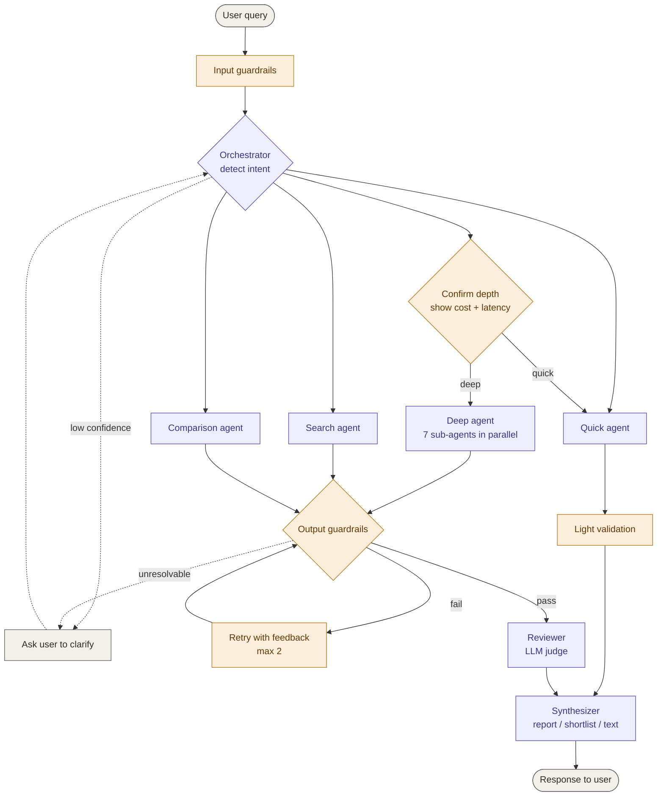
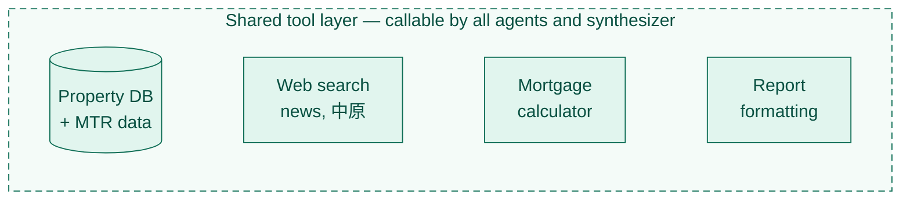
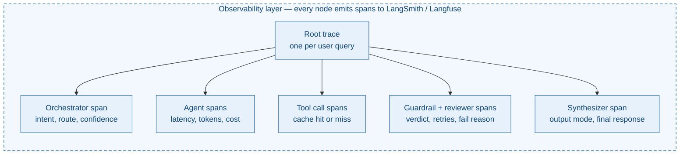

# pptyhk
## What 
In one sencentence: AI-Driven Hong Kong Property Risk Checker for 1st Time Home Buyer

Website: https://pptyhk.vercel.app

## Who and why
The primary user is a first-time Hong Kong private-market buyer who is actively considering buying their first flat.

They usually have enough savings to start looking seriously, but limited experience judging whether a property is a good long-term decision. They may understand the headline price and mortgage amount, but they are less confident about resale liquidity, future upgrade potential, district quality, transport reality, and whether the property is fairly priced against better alternatives.

This buyer is not casually browsing. They are somewhere between "I think I should buy soon" and "I may buy this specific option." The decision feels high-stakes because a bad first purchase can damage years of savings and make future upgrading harder.

Hence, first-time Hong Kong buyers can find property information, but they struggle to make a high-quality and confidence decision on a specific property candidate.

They would love to know whether the candidate is financially safe, fairly priced, resaleable, and compatible with their future upgrade path.

## Product Roadmap
Phase 1 - Single Agent, one click quick analysis, low latency
Phase 2 - Multi Agents analysis, comparsion
Phase 3 - Personalised property search

## Archtecture Diagram
Version 0

